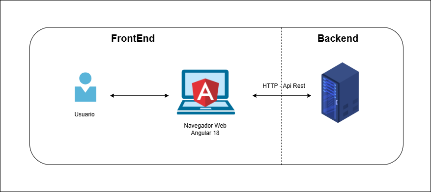

# Frontend ServiceDesk

Aplicación web ServiceDesk desarrollada con Angular CLI versión 18. 

## Requisitos Previos

Tener instalado lo siguiente:

- [Node.js](https://nodejs.org/) (versión **>=20.0.0**)
- npm (versión **≥9.0.0**)

## 1.Instalación de Angular CLI versión 18

Para instalar Angular CLI versión 18 globalmente en tu equipo ejecutar el siguiente comando `npm install -g @angular/cli@18`

## 2. Clonar el repositorio

`git clone https://github.com/n1c0145/front-tesis-servicedesk.git`

## 3. Instalación de Dependencias

Dentro del directorio del repositorio ejecutar el comando `npm install`

### Dependencias Utilizadas:

`aws-amplify` Integración con AWS Cognito (autenticación) y S3 (almacenamiento).

`jwt-decode` Para decodificar tokens JWT.

### Librerías de UI utilizadas:

`Angular Material`
`aws-amplify`
`Bootstrap`

## 4. Levantar el Servidor de Desarrollo

Dentro del directorio del repositorio ejecutar el comando `ng serve -o`

## Diagrama de Arquitectura FrontEnd

El siguiente diagrama muestra cómo se estructura la arquitectura del frontend Angular:

